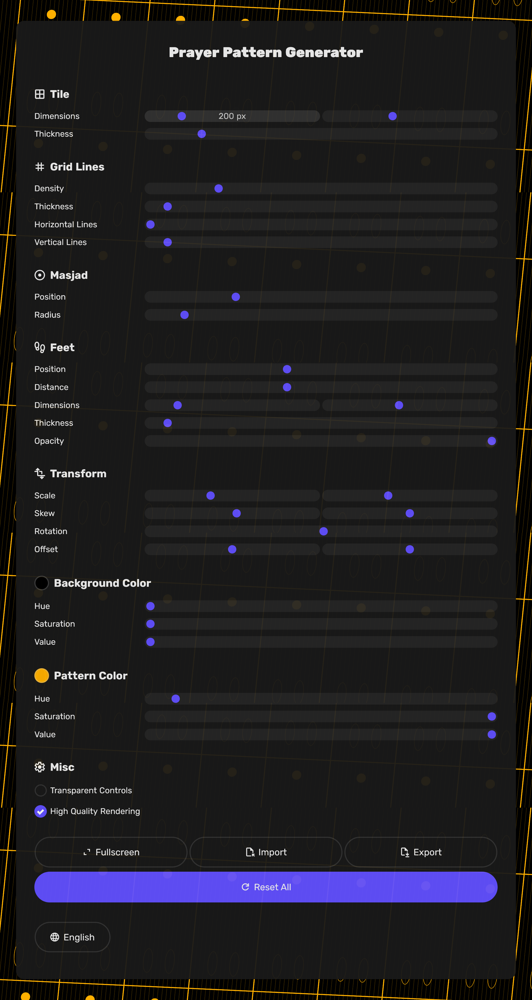

<div align="center">
<a href='https://ko-fi.com/E1E81LFRKY' target='_blank'></a>
</div>

# 🕌 Prayer Pattern Generator

This tool lets you generate patterns for group prayers (AKA Jama'ah) performed in
Muslim mosques. It's written in TypeScript and uses good old raw HTML and CSS
without any frameworks. It uses WebGL2 and a simple *(as long as you're a graphics programmer)* fragment shader to render a bunch of 2D shapes using 2D signed distance fields and jitter multi-sampling for anti-aliasing.

[Live Demo](https://hfarid.ir/prayer-pattern-generator)




# Why

The main motivation is to use one or more projectors on the ceiling of mosques to project this pattern onto the ground so that people can stand neatly in order.

# Features

- The many different parameters let you adjust the position and size of just about anything.

- You can export the parameters to a JSON file and import them back.

- Support for multiple languages. Currently just English and Persian, but feel free to implement your own language and make a pull request!

- Linear transforms that let you scale, skew, rotate, and offset the image without reaching the projector for its settings menu.

- Responsive, mobile-friendly design

# How to Build

Get an IDE (like [Visual Studio Code](https://code.visualstudio.com/)). Install [TypeScript](https://www.typescriptlang.org/). Run the following commands.

```
cd src
tsc
```

And you're done.
